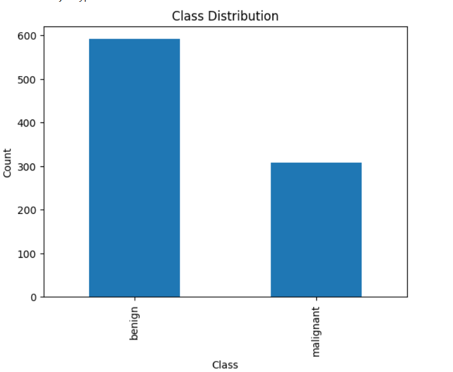

# 🏥 Breast Tumor Classification using Deep Learning

This project classifies breast tumors as malignant or benign using deep learning models. The implementation is provided in a Jupyter Notebook.

## 📊 Dataset

The dataset used in this project is the **Breast Ultrasound Images Dataset (BUSI)**, available on [Kaggle](https://www.kaggle.com/datasets/anaselmasry/datasetbusiwithgt). It contains ultrasound images labeled as benign, malignant, or normal. 

### 📌 Dataset Details:
- Number of images: **899**
- Categories: **Benign, Malignant**
- Preprocessing: **Resizing, Normalization, Data Augmentation**



## 🏗 Implementation

The project is implemented in a Jupyter Notebook, where **DenseNet** and **EfficientNet** are fine-tuned to classify breast tumor images. The models were chosen for their strong feature extraction capabilities and efficiency in transfer learning.

### ⚙️ Training Details:
- **Dataset Split:** 80% training, 21% validation, 9% test
- **Optimizer:** Adam
- **Loss Function:** Categorical Cross-Entropy
- **Early Stopping:** Used to prevent overfitting

## 🚀 Installation & Usage

To run the notebook, follow these steps:

```bash
# Clone the repository
git clone https://github.com/yourusername/Tumor-Classification.git
cd Tumor-Classification

# Install dependencies
pip install -r requirements.txt

# Open Jupyter Notebook
jupyter notebook
```

Then open `notebook.ipynb` and run the cells sequentially.

## 📈 Results & Performance

Our final models achieved the following performance metrics on the test set:

### DenseNet Results:
| Metric       | Benign  | Malignant |
|-------------|--------|-----------|
| Accuracy    | 85%    | 85%       |
| Precision   | 86%    | 82%       |
| Recall      | 92%    | 72%       |
| F1-score    | 89%    | 77%       |


### EfficientNet Results:
| Metric       | Benign  | Malignant |
|-------------|--------|-----------|
| Accuracy    | 87%    | 87%       |
| Precision   | 85%    | 93%       |
| Recall      | 98%    | 66%       |
| F1-score    | 91%    | 77%       |


## 📜 License

This project is licensed under the MIT License - see the [LICENSE](LICENSE) file for details.

## 🙌 Acknowledgments

- **Dataset:** [Kaggle - Breast Ultrasound Images Dataset](https://www.kaggle.com/datasets/anaselmasry/datasetbusiwithgt)
- **Models Used:** DenseNet, EfficientNet
- **Frameworks:** TensorFlow, Keras


